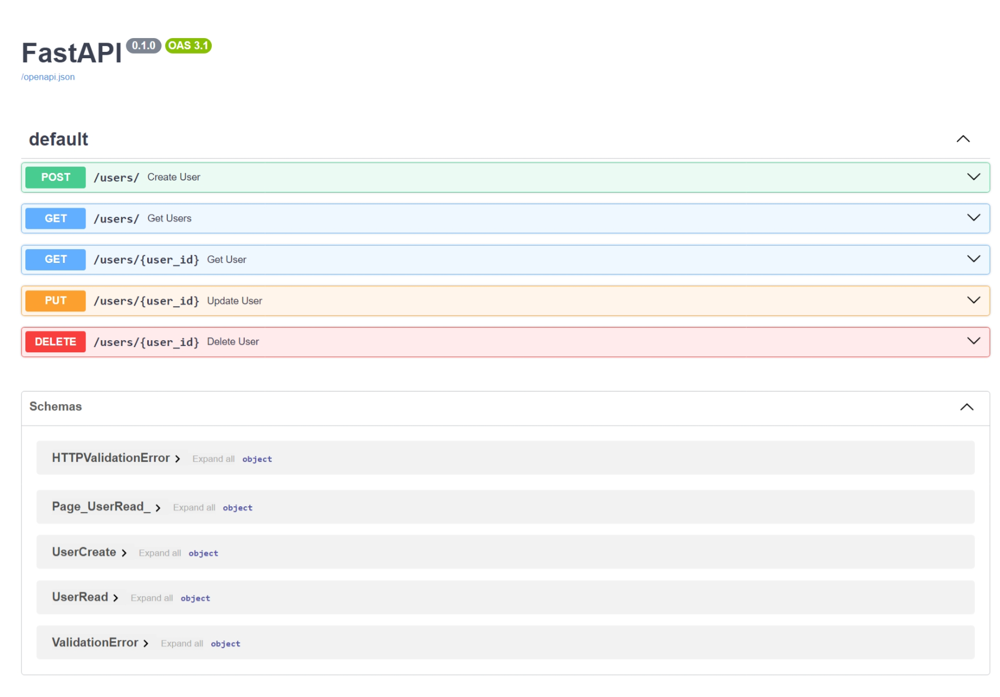
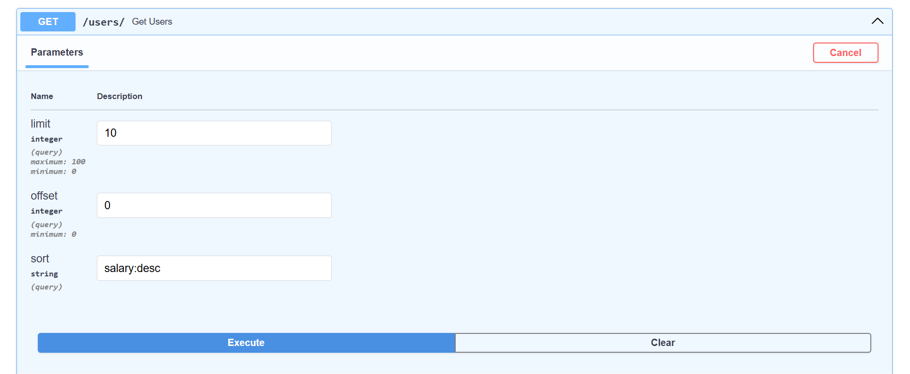

# OnePattern

One pattern for accessing data powered by SQLAlchemy & Pydantic.

## Features

- **CRUD**: Create, read, update, delete operations.
- **Pagination**: Built-in support for pagination & sorting.
- **Validation**: Automatic validation using Pydantic models.
- **Bulk operations**: Create, update, delete multiple records at once.
- **Unit of work**: Transactional support for multiple operations.

## Requirements

OnePattern stands on the shoulders of giants:

- [SQLAlchemy](https://www.sqlalchemy.org/)
- [Pydantic](https://pydantic-docs.helpmanual.io/)

## Installation

```bash
pip install onepattern
```

## Get Started

Let's write a simple CRUD API for managing users to demonstrate the power of OnePattern.

Create models:

```python
from datetime import datetime

from pydantic import BaseModel, ConfigDict
from sqlalchemy import Identity
from sqlalchemy.orm import DeclarativeBase, Mapped, mapped_column


class Base(DeclarativeBase):
    pass


class User(Base):
    __tablename__ = "users"

    id: Mapped[int] = mapped_column(Identity(), primary_key=True)
    name: Mapped[str]
    age: Mapped[int]
    salary: Mapped[int]
    created_at: Mapped[datetime] = mapped_column(default=datetime.now)
    updated_at: Mapped[datetime] = mapped_column(
        default=datetime.now, onupdate=datetime.now
    )


class UserBase(BaseModel):
    name: str
    age: int
    salary: int

    model_config = ConfigDict(from_attributes=True)


class UserCreate(UserBase):
    pass


class UserRead(UserBase):
    id: int
    created_at: datetime
    updated_at: datetime
```

Create repository:

```python
from sqlalchemy.ext.asyncio import create_async_engine, async_sessionmaker

from docs.gs_models import User, UserRead
from onepattern import AlchemyRepository


class UserRepository(AlchemyRepository[User, UserRead]):
    model_type = User
    schema_type = UserRead


async_engine = create_async_engine("sqlite+aiosqlite://", echo=True)
async_session = async_sessionmaker(async_engine)


async def get_users() -> UserRepository:
    async with async_session() as session:
        async with session.begin():
            yield UserRepository(session)
```

Use it in your app:

```python
from contextlib import asynccontextmanager
from typing import Annotated, Any

from fastapi import FastAPI, Depends, HTTPException

from docs.gs_models import Base, UserCreate, UserRead
from docs.gs_repository import UserRepository, async_engine, get_user_repo
from onepattern import PageParams, Page


@asynccontextmanager
async def lifespan(_app: FastAPI) -> Any:
    async with async_engine.begin() as conn:
        await conn.run_sync(Base.metadata.create_all)
    yield


app = FastAPI(lifespan=lifespan)


@app.post("/users/")
async def create_user(
        user: UserCreate, users: Annotated[UserRepository, Depends(get_user_repo)]
) -> UserRead:
    return await users.create(user)


async def get_user_dep(
        user_id: int, users: Annotated[UserRepository, Depends(get_user_repo)]
) -> UserRead:
    user = await users.get(user_id)
    if user is None:
        raise HTTPException(status_code=404, detail="User not found")
    return user


@app.get("/users/{user_id}")
async def get_user(
        user: Annotated[UserRead, Depends(get_user_dep)],
) -> UserRead:
    return user


@app.put("/users/{user_id}")
async def update_user(
        update: UserCreate,
        user: Annotated[UserRead, Depends(get_user_dep)],
        users: Annotated[UserRepository, Depends(get_user_repo)],
) -> UserRead:
    return await users.update(user.id, update)


@app.delete("/users/{user_id}")
async def delete_user(
        user: Annotated[UserRead, Depends(get_user_dep)],
        users: Annotated[UserRepository, Depends(get_user_repo)],
) -> UserRead:
    return await users.delete(user.id)


@app.get("/users/")
async def get_users(
        params: Annotated[PageParams, Depends()],
        users: Annotated[UserRepository, Depends(get_user_repo)],
) -> Page[UserRead]:
    return await users.get_many(params=params)

```

Run app:

```bash
uvicorn docs.gs_app:app --host 0.0.0.0 --port 8000 --reload
```



Pagination example:




## Extending models

OnePattern provides multiple ways to extend models:

1. Use mixins to add commonly-used columns:

```python
from sqlalchemy.orm import DeclarativeBase, Mapped

from onepattern.models import HasID, HasTimestamp


class Base(DeclarativeBase):
    pass


class UserMixins(Base, HasID, HasTimestamp):
    __tablename__ = "users"

    name: Mapped[str]
    age: Mapped[int]
    salary: Mapped[int]
```

> Tip: See `onepattern.schemas` for similar pydantic mixins.

2. Use pre-configured base model:

```python
from datetime import datetime

from sqlalchemy import Identity
from sqlalchemy.orm import Mapped, mapped_column

from onepattern import AlchemyBase


class UserAlchemyBase(AlchemyBase):
    __tablename__ = "users"

    id: Mapped[int] = mapped_column(Identity(), primary_key=True)
    name: Mapped[str]
    age: Mapped[int]
    salary: Mapped[int]
    created_at: Mapped[datetime] = mapped_column(default=datetime.now)
    updated_at: Mapped[datetime] = mapped_column(
        default=datetime.now, onupdate=datetime.now
    )
```

3. Use entity model with commonly-used columns:

```python
from sqlalchemy.orm import Mapped

from onepattern import AlchemyEntity


class UserAlchemyEntity(AlchemyEntity):
    __tablename__ = "users"

    name: Mapped[str]
    age: Mapped[int]
    salary: Mapped[int]
    # id, created_at and updated_at are added automatically

```

> Tip: See `onepattern.schemas.EntityModel` for similar pydantic base.

**Made with love ❤️**
